[Azure Devops task list](https://learn.microsoft.com/en-us/azure/devops/pipelines/tasks/reference/?view=azure-pipelines)
[YAML Schema reference for azure](https://learn.microsoft.com/en-us/azure/devops/pipelines/yaml-schema/pipeline?view=azure-pipelines)

## ex:1
## Pipeline is collection of jobs
Manual Steps:

* Get code from git
    * `git clone https://github.com/Aravindh-29/DbTestApp.git`
* build the docker image from docker file present in the folder
    * `cd DbTestApp/DbConnectionTester/`
    * `docker image build -t dbapp:latest .`

* Creating a pipeline for above task

```yaml


stages:
  - stage: ci
    displayName: building code
    jobs:
      - job: docker
        displayName: build image on Docker
        pool:
          vmImage: ubuntu-22.04
        steps:
          - task: Docker@2
            inputs:
              command: build
              Dockerfile: '**/Dockerfile'


```
## Pipeline is collection of jobs:

```yaml

jobs: ci
  - job: build
    displayName: docker build
    pool:
      vmImage: ubuntu-22.04
    steps:
      - task: Docker@2
        inputs:
          command: build
          Dockerfile: '**/Dockerfile'
```

## ex:2

## Lets build a project [https://github.com/Aravindh-29/DbTestApp.git]
* Jobs:
    * Dotnet build
        * `dotnet build DbConnectionTester.sln`
    * Docker build
        * `docker compose build`
* Dotnet build Task:

- task: DotNetCoreCLI@2
  inputs:
    command: 'build'
    projects:  DbConnectionTester.sln
- task: DockerCompose@1
  inputs:
  containerregistrytype: 'Azure Container Registry'
  dockerComposeFile: '**/docker-compose.yml'
  action: Build services

**pipeline**
```yaml

jobs:
  - job: dotnetbuild
    displayName: Build using dotnet
    pool:
      vmImage: ubuntu-22.04
    steps:
      - task: DotNetCoreCLI@2
        inputs:
          command: 'build'
          projects: '**/DbConnectionTester.sln'

  - job: dockercompose
    displayName: Build using docker compose
    dependsOn: dotnetbuild 
    pool:
      vmImage: ubuntu-22.04
    steps:
      - task: DockerCompose@0
        inputs:
          containerregistrytype: 'Azure Container Registry'
          dockerComposeFile: '**/docker-compose.yml'
          action: 'Build services'
          projectName: 'dbconnectiontester'

```
## Pipeline is collection of stages

```yaml
stages:
  - stage: build
    displayName: Build Stage
    jobs:
      - job: dotnetbuild
        displayName: Building dotnet project
        pool:
          vmImage: ubuntu-22.04
        steps:
          - task: DotNetCoreCLI@2
            inputs:
              command: 'build'
              projects: '**/*.sln'   # Correct pattern: look for .sln file

  - stage: compose
    displayName: Compose Stage
    dependsOn: build    # stage dependsOn, not job
    jobs:
      - job: dockercompose
        displayName: Docker Compose
        pool:
          vmImage: ubuntu-22.04
        steps:
          - task: DockerCompose@1
            inputs:       # you missed this 'inputs' keyword
              containerregistrytype: 'Azure Container Registry'
              dockerComposeFile: '**/docker-compose.yml'
              action: 'Build services'   # correct wording
              projectName: 'dbconnectiontester'

```
## Triggers

* This controls when the pipeline will be executed.
* pipeline execution is controlled by 
  * trigger 
  * pr(pull request) -> Branch merge request ichinappudu automatic pipeline run avuthundhi.
  * schedule -> specific time ki (like daily at 6AM ) pipeline run cheyydam. [crontab.guru]
  * Manual - manual ga trigger cheyyadam.
```yaml
trigger:
  branches:
    include:
      - main

pr:
  branches:
    include:
      - main

schedules:
  - cron: "0 6 * * *"
    displayName: Daily 6AM Run
    branches:
      include:
        - main
    always: true

```

### spring Petclicnic pipeline

* Lets make changes in the pipeline to trigger this pipeline
  * whenever any changes are done in main branch
  * On saturday at 1:00 Am.

```yaml

trigger:
  - main
schedules:
  - cron: '30 1 * * 6'
    displayName: saturday at 1:30 Am
    branches:
      include:
        - main
parameters:
  - name: jdkVersion
    displayName: java version
    type: string
    default: 1.17
pool:
  vmImage: ubuntu-22.04

stages:
  - stage: build_stage
    displayName: Build Stage
    jobs:
      - job: build
        displayName: Maven build
        steps:
          - task: Maven@4
              inputs:
                mavenPOMFile: 'pom.xml'
                publishJUnitResults: true
                testResultsFiles: '**/surefire-reports/TEST-*.xml'
                javaHomeOption: 'JDKVersion'
                jdkVersionOption: "${{parametersjdkVersion}}"      

```

## Artificat Locations

* Artifact locations are used to store the output of the pipeline.

## Variables

```yaml
variables:
  DEFAULT_BRANCH: master
```

```yaml

variables:
  DEFAULT_BRANCH: master

trigger:
  - "$(DEFAULT_BRANCH)"

schedules:
  - cron: '30 1 * * 6'
    displayName: saturday at 1:30 Am
    branches:
      include:
        - "$(DEFAULT_BRANCH)"
parameters:
  - name: jdkVersion
    displayName: java version
    type: string
    default: 1.17
pool:
  vmImage: ubuntu-22.04

stages:
  - stage: build_stage
    displayName: Build Stage
    jobs:
      - job: build
        displayName: Maven build
        steps:
          - task: Maven@4
              inputs:
                mavenPOMFile: 'pom.xml'
                publishJUnitResults: true
                testResultsFiles: '**/surefire-reports/TEST-*.xml'
                javaHomeOption: 'JDKVersion'
                jdkVersionOption: "${{parametersjdkVersion}}"

```
## Variable Groups

* it is recomended to use variable groups 
  * when variables have sensitive information
  * too many variables
  * to make sensitive variables secure, varibale groups can be linked to azure key vault

## Templates

* Reusable pipelines or parts of pipelines are reffered as Templates.


* full template

```yaml

pool:
  vmImage: ubuntu-22.04
variables:
  DEFAULT_BRANCH: master
trigger:
  - "$(DEFAULT_BRANCH)"
schedules:
  - cron: '30 1 * * 6'
    branches:
      include:
        - "$(DEFAULT_BRANCH)"
parameters:
  - name: jdkversion
    type: string
    default: '1.17'
    values:
      - 1.17
      - 1.18
      - 1.8
      - 1.9

stages:
  - stage: javabuild
    displayName: javabuild
    jobs:
      - job: build
        displayName: Build Simple MVN App
        steps:
          - task: Maven@4
            inputs:
              mavenPOMFile: 'pom.xml'
              goals: 'clean package'
              publishJUnitResults: true
              testResultsFiles: '**/surefire-reports/TEST-*.xml'
              javaHomeOption: 'JDKVersion'
              jdkVersionOption: ${{parameters.jdkversion}}
          

```

* Deviding above pipeline

1. stages template [write parameters in this code]

```yaml

parameters:
  - name: jdkversion
    type: string
    default: '1.17'
stages:
  - stage: javabuild
    displayName: javabuild
    jobs:
      - job: build
        displayName: Build Simple MVN App
        steps:
          - task: Maven@4
            inputs:
              mavenPOMFile: 'pom.xml'
              goals: 'clean package'
              publishJUnitResults: true
              testResultsFiles: '**/surefire-reports/TEST-*.xml'
              javaHomeOption: 'JDKVersion'
              jdkVersionOption: ${{parameters.jdkversion}}

```
2. azure pipeline template

```yaml

pool:
  vmImage: ubuntu-22.04
variables:
  DEFAULT_BRANCH: master
trigger:
  - "$(DEFAULT_BRANCH)"
schedules:
  - cron: '30 1 * * 6'
    branches:
      include:
        - "$(DEFAULT_BRANCH)"
parameters:
  - name: jdkver
    type: string
    default: '1.17'
    values:
      - 1.17
      - 1.18
      - 1.19
resources:
 repositories:
   - repository: templates
     name: AzureDevopsTemplates
     ref: main
     type: git
stages:
  - template: Maven/build-stage.yaml@templates
    parameters:
      jdkversion: "${{parameters.jdkver}}

```

## Azure Service Connections

* Docker Connection to push images

* from project settings navigate to service connections inside create new service connection, select docker registry, provide your dockerhub id and password and enable for all pipelines and save.

```yaml

stages:
  - stage:
    jobs:
      - job: docker
        steps:
          - task: Docker@2
            inputs:
              command: 'buildAndPush'
              Dockerfile: '**/Dockerfile'
              containerRegistry: Docker_Hub
              tags: '$(Build.BuildId)'
              repository: 'aravindh146/adomay27'
```

## Deployments in AzureDevops

# A Complete build and publish Activity

### Here we are going to take an Application we build it and deploy it in System test Environment through Terraform.

**Step1:**

* Import your Application Repository to AzureRepos, Ensure you have the same application in a Folder.

* Open the Application in VS code and keep it Ready.

**Step2:**

* Initially We will write a pipeline for only to build the code.
* We will write a build stage now, Here i am going to use .Net Application.

```yaml
stages:
  - stage: Build
    jobs:
      - job: Build
        pool:
          vmImage: ubuntu-22.04
        steps:
          - task: DotNetCoreCLI@2
            inputs:
              command: 'build'
              projects: '**/*.csproj'
          - task: DotNetCoreCLI@2
            inputs:
              command: 'publish'
              publishWebProjects: false
              arguments: '-o $(Build.ArtifactStagingDirectory)/Output'
              zipAfterPublish: true
              modifyOutputPath: true
          - task: PublishBuildArtifacts@1
            inputs:
              pathToPublish: $(Build.ArtifactStagingDirectory)
              artifactName: DbAppOutputs
```
or 
* Publish will build by default to produce outputs, so no need of including build task.
```yaml
stages:
  - stage: Build
    jobs:
      - job: Build
        pool:
          vmImage: ubuntu-22.04
        steps:
          - task: DotNetCoreCLI@2
            displayName: 'dotnet publish'
            inputs:
              command: 'publish'
              publishWebProjects: false
              arguments: '-o $(Build.ArtifactStagingDirectory)/Output'
              zipAfterPublish: true
              modifyOutputPath: true
          - task: PublishBuildArtifacts@1
            inputs:
              pathToPublish: $(Build.ArtifactStagingDirectory)
              artifactName: DbAppOutputs
```
## ✅ Understanding the Pipeline with Real-Time Example

### 🎯 Scenario:

You're building a **.NET Core web application** called `MyWebApp`, and your goal is to:

1. **Build** the app (compile the code)
2. **Package the build output** (DLLs, config files, etc.)
3. **Store the output (artifact)** so it can be used later for deployment


## 🧱 Step-by-Step Breakdown of the Pipeline Tasks


### 🔨 1. `DotNetCoreCLI@2` - **Build Task**

```yaml
- task: DotNetCoreCLI@2
  inputs:
    command: 'build'
    projects: '**/*.csproj'
```

🔹 **What it does:**
This compiles your code into DLLs. It checks for syntax errors, restores dependencies, and produces a build in the `/bin` directory.

🔹 **Real-life analogy:**
Imagine you're preparing for a presentation. This is like writing and organizing your slides (but **not yet printing or packaging them**).


### 📦 2. `DotNetCoreCLI@2` - **Publish Task**

```yaml
- task: DotNetCoreCLI@2
  inputs:
    command: 'publish'
    publishWebProjects: true
    arguments: '-o $(Build.ArtifactStagingDirectory)/Output'
    zipAfterPublish: true
```

🔹 **What it does:**
The **publish** command **prepares the build output** for deployment. It puts all the necessary files (DLLs, config files, wwwroot, etc.) into a single output folder.

It also **zips** the result into one file (if `zipAfterPublish: true`) so it's ready to be sent to a server.

🔹 **Real-life analogy:**
You're done creating the slides. Now you **export the final version as a PDF** to share with your manager. That "PDF" is like your **published output**.


### 📤 3. `PublishBuildArtifacts@1` - **Artifact Upload Task**

```yaml
- task: PublishBuildArtifacts@1
  inputs:
    PathtoPublish: '$(Build.ArtifactStagingDirectory)/Output'
    ArtifactName: 'drop'
    publishLocation: 'Container'
```

🔹 **What it does:**
This task **uploads** the published files as an **artifact** in Azure DevOps. These artifacts can be **used in later stages** (like deploying to a server).

🔹 **Real-life analogy:**
You’ve created the PDF (published). Now you **upload it to Google Drive** (artifact storage) so your team or manager can access and use it.


## 🧭 Full Example in Real-Time Terms

Imagine you are:

* 👨‍💻 Writing code = Development
* 🔧 `build` step = Compile the code
* 📦 `publish` step = Create a deployable package
* ☁️ `PublishBuildArtifacts` step = Upload it to cloud storage for your DevOps pipeline


**Step3:**

* As we are using Azure Devops free version we will get only one Microsoft hosted agent, for our requirement we need to create one self hosted agent with configuration on Azure CLI.

**How to configure/Add Self Hosted Agent**

1. Naviagate to the Azure Devops open the project
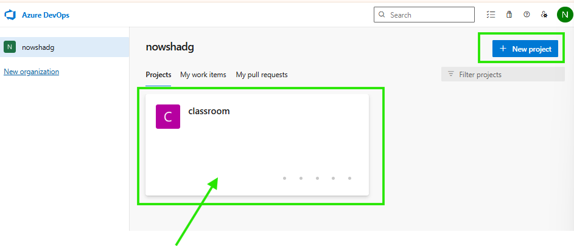
2. Now Open Project Settings
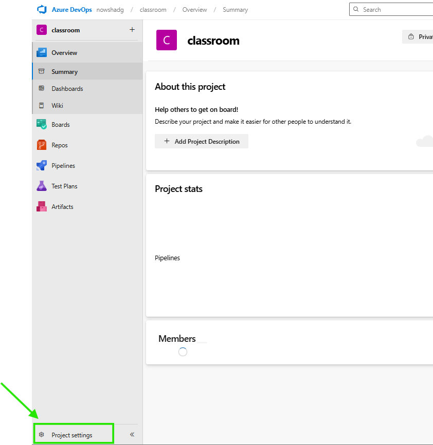
3. Select Agent pool
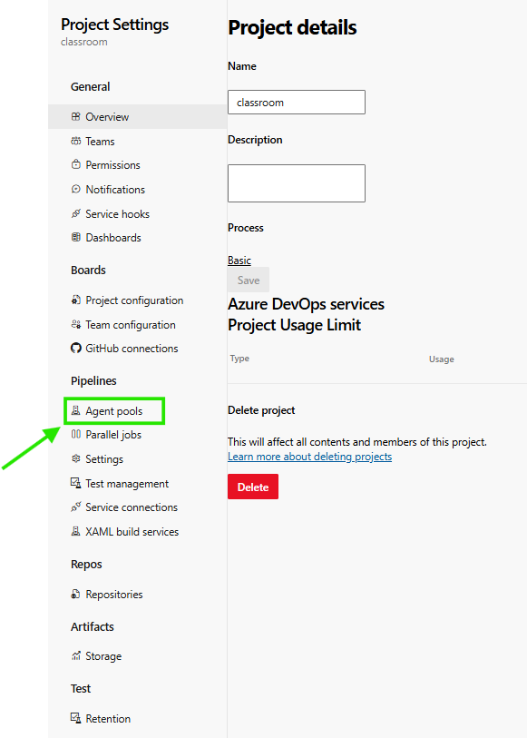
4. Select Default
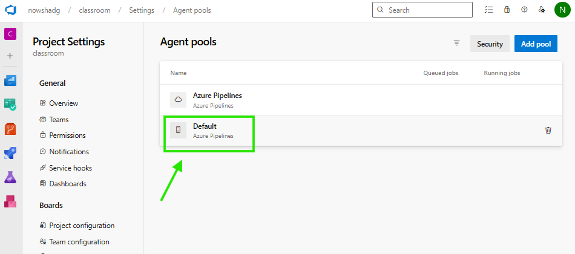
5. Select UserSettings
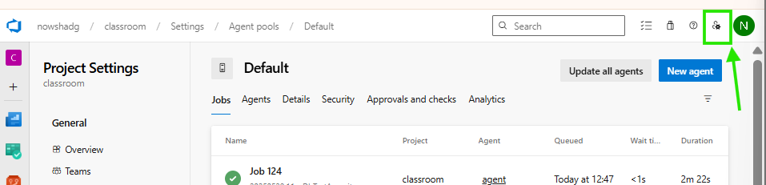
6. Select Personal Access tockens
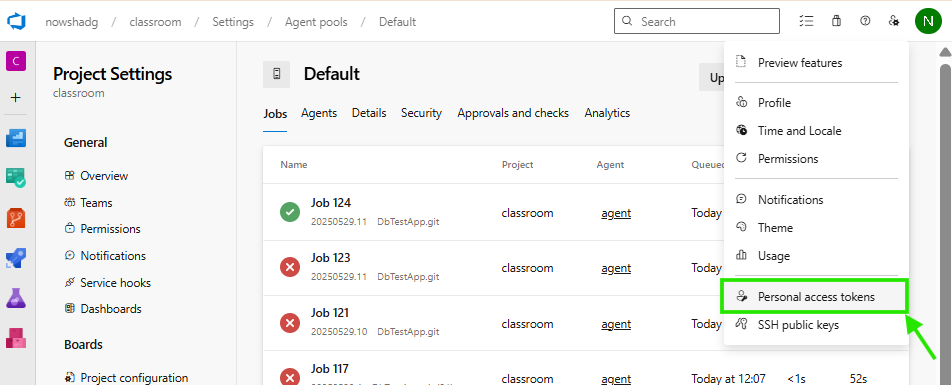
7.Create New
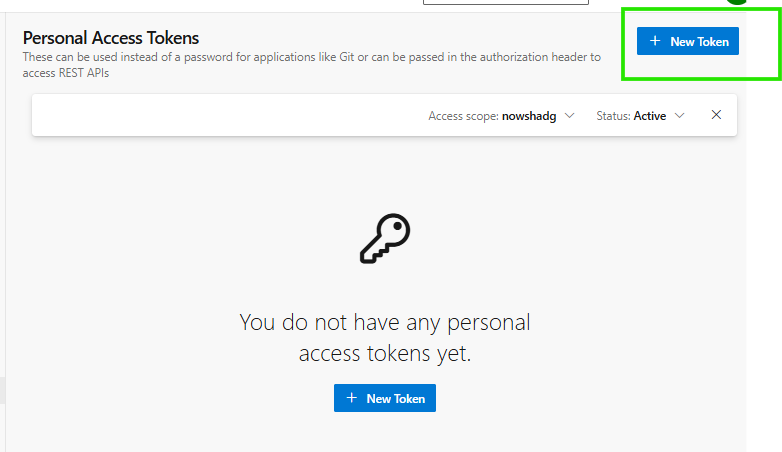
8. Fill the details and create
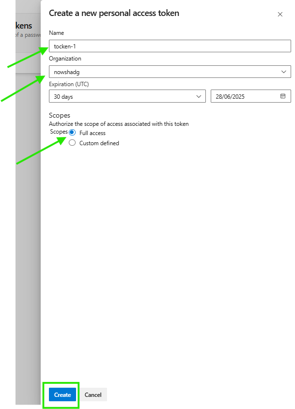
9. Copy the tocken it will show only once copy and save it in notepad.
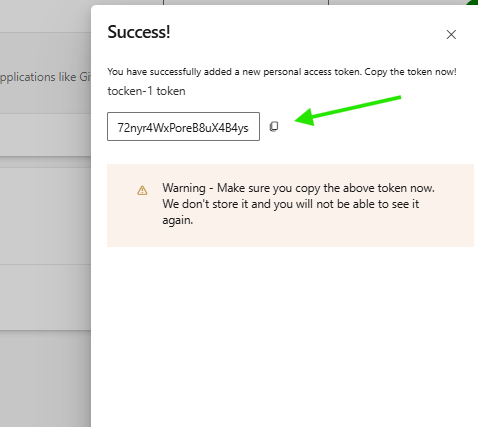

10. Now create a Ubuntu Server having more RAM/Cpu's for fast execution, either in Azure or AWS.

11. Connect from your powershell by ssh, and install Azure CLI or AWS CLI based on where you want to create infra to deploy the Application.

**Installing Azure CLI**

* Open the link[click here](https://learn.microsoft.com/en-us/cli/azure/install-azure-cli-linux?view=azure-cli-latest&pivots=apt) and follow Option 1 for easiest installation

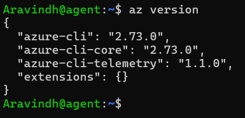
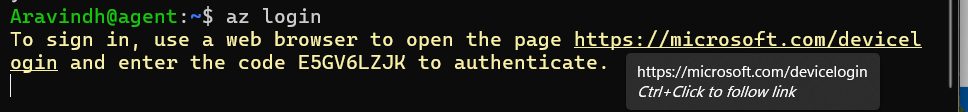
From below image shows i have loged in and get resource groups
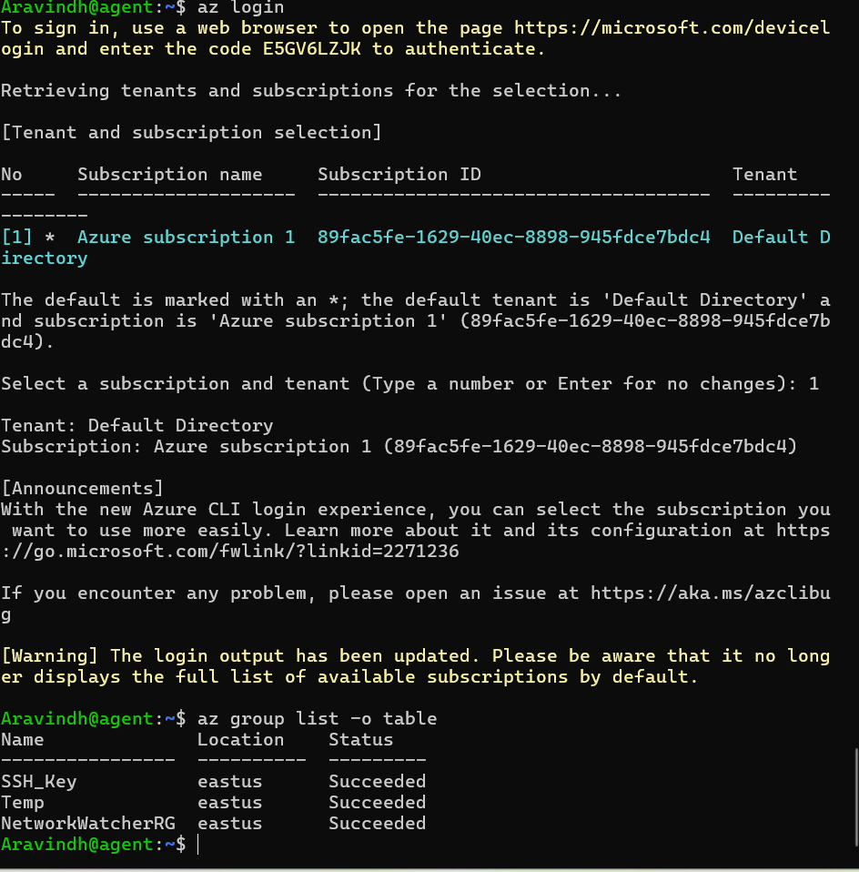

**Installing Terraform**

* Open the link [click here](https://developer.hashicorp.com/terraform/install) and copy the link and paste and run. this will install Terraform in your machine.
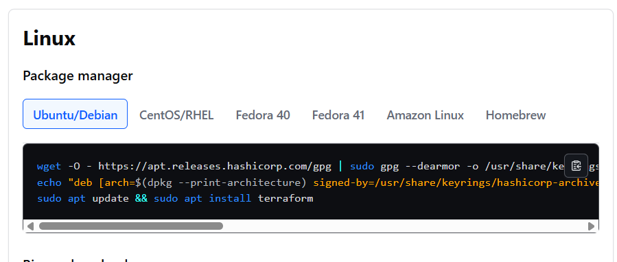
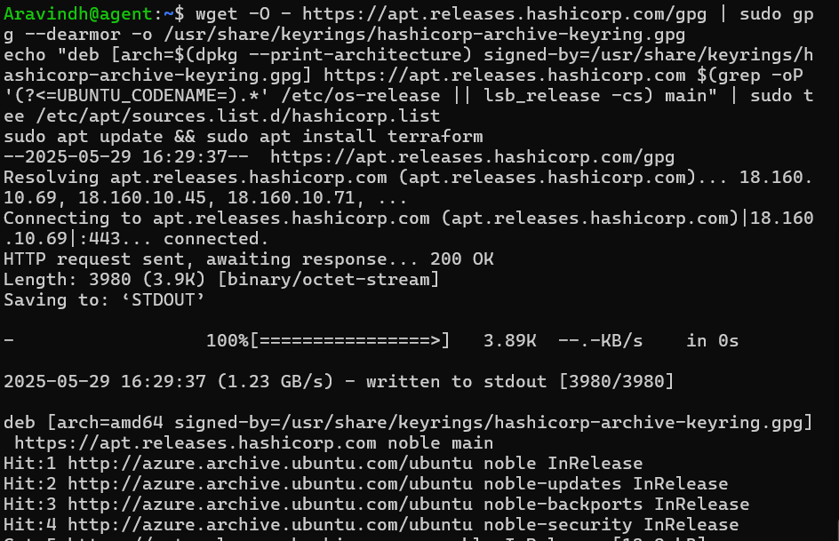
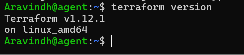

**Configuring as Self Hosted Agent**

* Open AzureDevops > Project Settings > Agent pool > Default > create new.
* When you select New below image shows
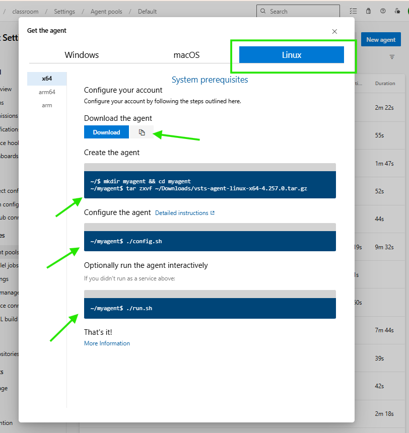
* copy the agent first and use `wget` and download it.
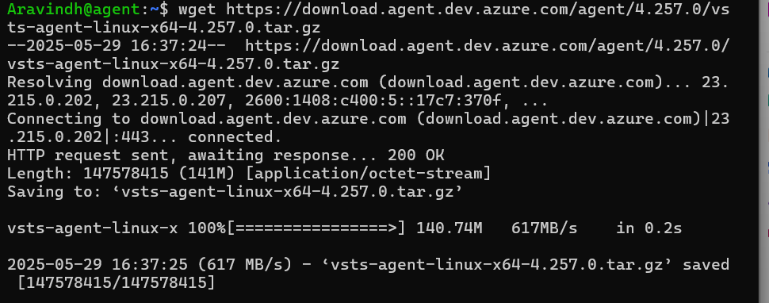
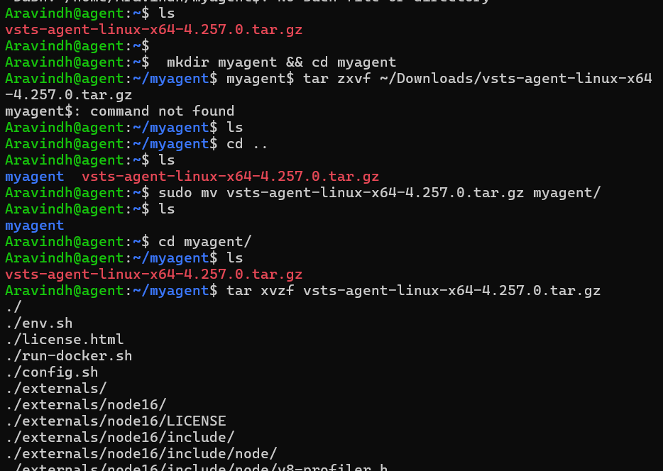
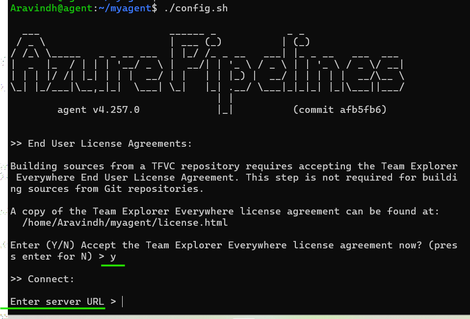

* copy and paste url `https://dev.azure.com/nowshadg`
* follow the asking promts and react and run finally `./run.sh` this brigs the server online.
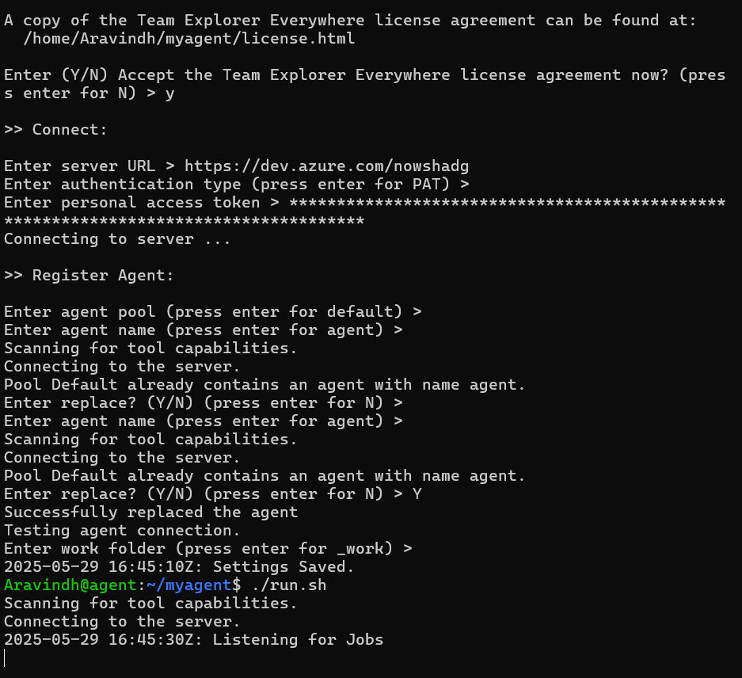
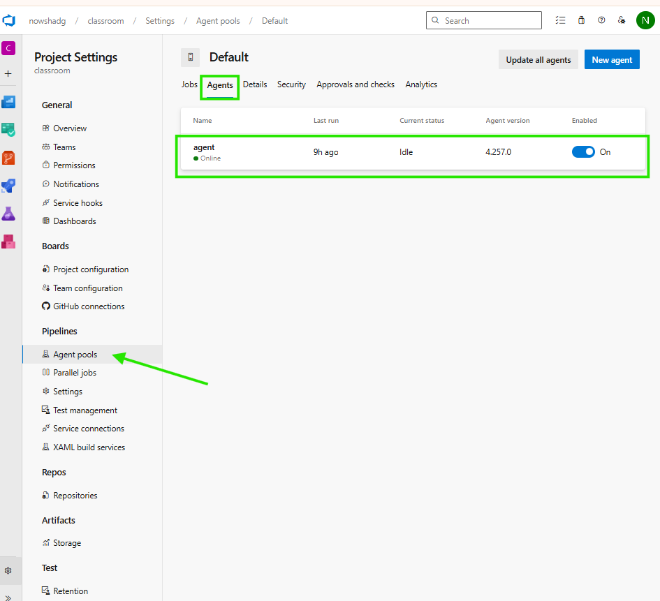

**Step4:**

1. Now we will write pipeline script for deployment the Application 

```yaml
stages:
  - stage: Build
    jobs:
      - job: Build
        pool:
          vmImage: ubuntu-22.04
        steps:
          - task: DotNetCoreCLI@2
            displayName: 'dotnet publish'
            inputs:
              command: 'publish'
              publishWebProjects: false
              arguments: '-o $(Build.ArtifactStagingDirectory)/Output'
              zipAfterPublish: true
              modifyOutputPath: true
          - task: PublishBuildArtifacts@1
            inputs:
              pathToPublish: $(Build.ArtifactStagingDirectory)
              artifactName: DbAppOutputs
  - stage: Deploy
    dependsOn: Build
      jobs:
        - job: systemtest environment
          pool: Default
          steps:
            - task: DownloadBuildArtifacts@1
              inputs:
                buildType: 'current'
                artifactName: DbAppOutputs
                downloadPath: '$(System.ArtifactsDirectory)'
            - bash: |
                terraform init
                terraform apply -var-file='dev.tfvars' -auto-approve'
              displayName: Terraform VM deployment
              workingDirectory: DbConnectionTester/deploy/Terraform

```

